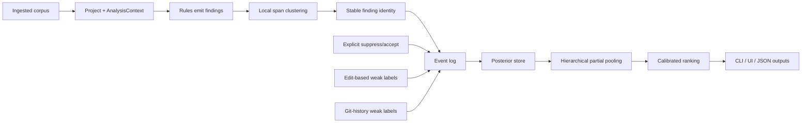

# Repository Review of Scripture Sous Chef

## Executive summary

The supplied repository snapshot describes a thoughtfully designed Rust engine for anomaly detection in Bible translations, with an unusually strong emphasis on explicit architecture, inspectability, and corpus-scale realism. The core choices are mostly sound: using Dunning log-likelihood ratio for sparse contingency-style evidence is defensible; using modified Kneser–Ney for future character-level language modeling is a strong fit; and treating the system as a collection of weak, largely independent signals is a reasonable product strategy for low-resource settings. Those choices line up with the literature the code cites and with broader practice in sparse text modeling. citeturn1search1turn1search3turn3search7

The main architectural weakness is not in the statistical primitives. It is in the boundary between findings, suppressions, aggregation, and future learning. The current engine suppresses by `(rule_id, sid)` rather than by a stable finding identity, while some rules intentionally emit multiple findings for the same rule in the same verse. At the same time, the proposed evidence-layer design wants to replay cluster-level positives and negatives into posteriors keyed by `(rule_id, cluster_key)`. That makes the proposed bridge from current suppressions to Bayesian updates unsound as written: the existing suppression surface is too coarse to serve as labeled data. This is the single most important issue to fix before implementing the evidence layer.

A second major issue is calibration architecture. A per-cluster Beta-Binomial posterior is a good baseline for high-volume, homogeneous, low-dimensional clusters such as punctuation conventions. It is not, by itself, the right long-term answer for sparse project-specific clusters, for noisy sources like git-mined edits, or for day-zero behavior on new projects. The right direction is hierarchical partial pooling: script-level or family-level priors for truly universal clusters, project-level shrinkage where data exists, and source-specific reliability weights or latent-noise modeling for weak labels. A straight posterior mean over heterogeneous event types will be too brittle. citeturn5search0turn5search3turn2search2

The repository is also operationally incomplete in ways that matter for maintainability rather than theory. The supplied snapshot has no root workspace manifest, no `Cargo.lock`, no CI/CD configuration, no visible license file, and no automated vulnerability/audit configuration. The code and docs are rich, but some of them drift: `VISION.md` still describes TOML and TSV authoring surfaces while the current CLI uses JSON/JSONC config with embedded exceptions. The public rule catalog lists far more rule IDs than the engine actually runs. These are fixable, but they currently weaken trust in the repo as an executable artifact rather than a promising research codebase.

The bottom-line judgment is favorable but qualified. The present system is viable as a careful, inspectable v1 anomaly engine. The proposed evidence layer is promising, but it should not be implemented as a simple append-only Beta-Binomial accumulator over the current finding model. The correct next move is to harden the identity model of findings, narrow the suppression semantics, add local span-level clustering, and introduce hierarchical partial pooling only for the cluster families that genuinely support it. If that sequence is followed, the architecture is strong. If it is skipped, the learning layer will likely become a source of false confidence rather than better ranking.

## Scope and evidence base

This report is based on the attached bundled snapshot rather than a live clone. The bundle is a Repomix-style merged representation and appears to contain a subset of the repository. In practical terms, that means several conclusions are static-analysis conclusions, not build-verified conclusions.

The repository’s stated product target is a Rust library and CLI for statistical proofreading of scripture corpora that can be embedded in translator workflows. The surrounding research materials indicate intended use inside tools built by entity["organization","Wycliffe Associates","bible translation org"], and the audit notes explicitly compare techniques with work associated with entity["organization","SIL Global","language dev nonprofit"]. The external tool landscape matters because the project is trying to differentiate itself from existing Bible-translation tooling by focusing on lightweight, corpus-aware anomaly detection rather than large pretrained models or dictionary-heavy checking. Official materials for Paratext confirm that the incumbent ecosystem already offers collaboration, checking, spell-check, glossary, and translation-resource features. That means the strongest differentiation path for this repo is explainable anomaly ranking and embeddable offline analysis, not generic “checking tools” as such. citeturn6search0turn6search2turn6search4

Two material limitations affected the analysis. First, the bundled snapshot omitted the workspace root manifest and lockfile, so exact dependency resolution and a precise RustSec audit were not possible. Second, the prompt text referenced calibration profiles under `data/calibration/`, but those profile JSONs were not present in the attached code snapshot I could inspect. As a result, the feasibility assessment relies on the research docs and the code in the bundle, not on recomputation over calibration artifacts.

## Repository audit

The repository snapshot is compact and coherent. The exposed tree centers on a `core` crate, a `cli` crate, and research/documentation folders.

```text
crates/
  cli/
    Cargo.toml
    src/
      bin/
        sous.rs
        profile_corpora.rs
        profile_ebible.rs
        plot_calibration.rs
        vref_dump.rs
      config_loader.rs
  core/
    Cargo.toml
    src/
      analysis/
      signals/
      aggregate.rs
      config.rs
      context.rs
      diagnostics.rs
      discourse.rs
      lib.rs
      profile.rs
      project.rs
      rule.rs
      script.rs
      sid.rs
      unicode.rs
      verse.rs
documentation/
  concepts_and_config.md
  rule_playbook.md
research/
  VISION.md
  METHODS.md
  evidence_layer_design.md
  sil_audit.md
  sil_audit_implemented.md
  gpt-research-response.md
```

A small static scan of the supplied tree found 39 Rust source files and 112 `#[test]` functions. No `.github/`, `.gitlab-ci`, `Cargo.lock`, `Makefile`, or `justfile` were present in the attached subset.

```text
$ find crates -name '*.rs' | wc -l
39

$ rg -n '^\s*#\[test\]' crates | wc -l
112

$ find . -path './.github*' -o -path './.gitlab-ci*' -o -path './.circleci*' -o -name 'Cargo.lock' -o -name 'Makefile' -o -name 'justfile'
# no output
```

### Structure and architecture

The current architecture is modular and understandable. `ssc-core` owns the engine contract; `Project`, `AnalysisContext`, and `Rule` define the runtime; and the CLI crate wraps ingestion, config loading, and JSON/debug output. In file terms, the hot path is:

- `crates/core/src/lib.rs`: entry points `analyze` and `analyze_with_stats`
- `crates/core/src/context.rs`: shared discourse, lexicon, transition, and span-index bootstrap
- `crates/core/src/rule.rs`: rule trait and default runtime rule set
- `crates/core/src/aggregate.rs`: Sid-level score aggregation
- `crates/cli/src/bin/sous.rs`: dogfood CLI and JSON/debug writers

The default runtime rule set is intentionally small and focused:

`crates/core/src/rule.rs:157-170`

```rust
pub fn default_rules() -> Vec<Box<dyn Rule>> {
    vec![
        Box::new(signals::hygiene::TabInBody),
        Box::new(signals::hygiene::ControlChars),
        Box::new(signals::hygiene::ZeroWidthMisuse),
        Box::new(signals::hygiene::EmptyVerse),
        Box::new(signals::source_relative::Proportionality),
        Box::new(signals::positional::SentenceStartCase),
        Box::new(signals::positional::UnexpectedSentenceEnd),
        Box::new(signals::punctuation::PairedPunctBalance),
    ]
}
```

That is a sensible initial product surface. The problem is that the *declared* rule universe is much larger than the *executed* rule universe. `crates/core/src/signals/mod.rs:19-40` enumerates 21 rule IDs, including orthographic, lexical, glossary, edit-distance, and punctuation-convention rules that do not appear in `default_rules()` and in several cases are clearly still TODO stubs. This creates a documentation/runtime mismatch: config validation accepts rule IDs for capabilities that the engine does not yet actually run.

### Languages, frameworks, and dependencies

The primary implementation language is Rust. There is no evidence of JS/TS, Python, or web framework code in the supplied subset.

The code uses a small, sensible Rust dependency set:

| Manifest                 | Dependency              | Version spec in snapshot | Notes                                          |
| ------------------------ | ----------------------- | -----------------------: | ---------------------------------------------- |
| `crates/core/Cargo.toml` | `unicode-segmentation`  |       `workspace = true` | Exact version unavailable in supplied snapshot |
| `crates/core/Cargo.toml` | `unicode-normalization` |       `workspace = true` | Exact version unavailable                      |
| `crates/core/Cargo.toml` | `icu_segmenter`         |       `workspace = true` | Exact version unavailable                      |
| `crates/core/Cargo.toml` | `serde`                 |           `1.0` optional | Explicit semver range present                  |
| `crates/cli/Cargo.toml`  | `ssc-core`              |       `workspace = true` | Internal crate                                 |
| `crates/cli/Cargo.toml`  | `ssc-ingest`            |       `workspace = true` | Internal crate not included in snapshot        |
| `crates/cli/Cargo.toml`  | `usfm_onion`            |       `workspace = true` | Exact version unavailable                      |
| `crates/cli/Cargo.toml`  | `plotters`              |       `workspace = true` | Exact version unavailable                      |
| `crates/cli/Cargo.toml`  | `serde`                 |                    `1.0` | Explicit semver range present                  |
| `crates/cli/Cargo.toml`  | `serde_json`            |                    `1.0` | Explicit semver range present                  |

This is a good dependency posture in spirit: small, mainstream crates, with ICU4X for segmentation rather than heavier language-model stacks. The main weakness is artifact incompleteness. Because the workspace root and lockfile are missing from the supplied bundle, six of the ten listed dependencies do not have resolvable versions here. That blocks precise reproducibility and precise security review.

From a security-source perspective, RustSec is the authoritative advisory registry to integrate for Rust dependency review. The repo currently shows no wired use of `cargo-audit`, `cargo-deny`, or similar automation, and without a root manifest/lockfile a machine-verifiable dependency audit is incomplete. citeturn0search9

### Build and run instructions

The snapshot does contain usable command-level guidance in source headers and docs. Examples include:

- `sous check [--nt-only] [--config <path>] [--source <dir>] [--all] <corpus-dir>` in `crates/cli/src/bin/sous.rs:13-57`
- `profile-corpora` usage in `crates/cli/src/bin/profile_corpora.rs:1-10`
- `profile-ebible` usage in `crates/cli/src/bin/profile_ebible.rs:1-16`
- `plot-calibration` usage in `crates/cli/src/bin/plot_calibration.rs:1-8`
- `vref-dump` usage in `crates/cli/src/bin/vref_dump.rs`

The top-level user-facing configuration documentation is also unusually detailed in `documentation/concepts_and_config.md`. The major issue is that documentation drift exists. `research/VISION.md:90-93` still says v1 uses TOML project config and TSV exception files, while current docs and code say the CLI discovers `sous.json` and parses JSON/JSONC with per-rule embedded exceptions (`documentation/concepts_and_config.md:77-83`, `crates/cli/src/config_loader.rs:1-66`). This kind of drift is not fatal, but it is exactly the kind that creates friction for adopters and for future contributors.

### CI/CD, tests, and coverage

No CI/CD configuration was included in the attached subset.

The codebase *does* show solid unit-test discipline, especially in core algorithmic modules. The best-tested areas are discourse/span indexing, lexicon classification, aggregation, punctuation classes, and rule primitives. That is a strength.

Actual line/branch coverage could not be measured from the supplied snapshot. The environment available to this analysis did not include a Rust toolchain, and the bundle lacked the workspace root needed for a normal `cargo test`/`cargo llvm-cov` run. The table below is therefore a **coverage proxy**, not a measured coverage report.

| Module group    | Rust files | Approx. LOC | Observed `#[test]` count | Coverage status                                    |
| --------------- | ---------: | ----------: | -----------------------: | -------------------------------------------------- |
| `core/runtime`  |         14 |       2,689 |                       43 | Strong unit-test footprint; no measured coverage   |
| `core/analysis` |          7 |       1,003 |                       30 | Good unit-test footprint; no measured coverage     |
| `core/signals`  |         12 |       3,233 |                       31 | Moderate unit-test footprint; no measured coverage |
| `cli`           |          6 |       1,547 |                        8 | Sparse compared with core; no measured coverage    |

The biggest maintenance hotspots by file size and branch density are:

| File                                                            | Approx. LOC | Rough branch points | Comment                      |
| --------------------------------------------------------------- | ----------: | ------------------: | ---------------------------- |
| `crates/core/src/signals/positional/sentence_start_case.rs`     |       1,067 |                  61 | Highest-risk logic hotspot   |
| `crates/core/src/discourse.rs`                                  |         775 |                  44 | Core cross-verse machinery   |
| `crates/core/src/analysis/lexicon.rs`                           |         575 |                  38 | Important shared primitive   |
| `crates/core/src/signals/positional/unexpected_sentence_end.rs` |         554 |                  35 | Dense statistical rule       |
| `crates/core/src/aggregate.rs`                                  |         460 |                  13 | Central scoring policy       |
| `crates/cli/src/bin/sous.rs`                                    |         383 |                  38 | Operational path and outputs |

These hotspots are also the files most likely to become bottlenecks for correctness and future refactoring.

### Security, secrets, licensing, and documentation quality

No obvious embedded credentials or private-key material were visible in a simple secret-pattern scan. That is the good news.

The less-good news is process hygiene:

- no visible CI or dependency-audit automation
- no visible license file
- no package `license` fields in the included Cargo manifests
- no root lockfile in the bundle
- no explicit security policy

The absence of a visible license is particularly important if the code is expected to be reused across teams or shared outside a single organization. As supplied, the legal reuse posture is ambiguous.

Documentation quality is mixed but promising. The research docs are unusually good: `METHODS.md`, `VISION.md`, `sil_audit_implemented.md`, and `evidence_layer_design.md` collectively make the code much easier to evaluate than most early-stage repositories. The practical weaknesses are drift and overpromising surface area. When the docs describe larger capability sets than the executable engine currently provides, they stop compounding trust.

## Statistical and ML assessment

### What is statistically sound

The choice to rely on Dunning LLR for sparse 2×2 evidence is one of the strongest parts of the design. Dunning’s original argument was precisely that asymptotic normal and standard chi-square approximations behave poorly on rare events, while likelihood-ratio methods remain useful in the small-count regime common in language data. That maps well to verse-pair co-occurrence and position-conditional token counts in New Testament-sized corpora. In other words, the repo’s instinct to prefer Dunning over Pearson chi-square for sparse event structure is correct. citeturn1search1

The future plan to use modified Kneser–Ney for character-level language modeling is also strong. Chen and Goodman’s comparative work remains the standard citation for why Kneser–Ney-style smoothing is such a strong default for n-gram models. For this project, char-level KN is especially attractive because it is language-agnostic, compact, and usable without lexicons or large data. citeturn1search3turn1search4

The repo is also right to worry that word-level bigram signals will degrade in highly agglutinative settings. The morphology literature does not imply that unsupervised segmentation magically solves everything, but it does support the basic claim that low-resource segmentation and morphology induction can materially help in morphologically rich languages. Morfessor remains a practical classical baseline, and recent low-resource segmentation work continues to show useful gains, especially for agglutinative morphology when raw surface forms are too sparse. citeturn3search7turn3search5

### What is statistically weak or under-specified

The current aggregation formula is simple and transparent, which is good, but it is still a policy layer rather than a calibrated model:

`crates/core/src/aggregate.rs:8-9`

```rust
score = sum(rule_weight × finding.evidence) × product(matching pair multipliers)
```

That is acceptable for v1 ranking, but it should be treated as a ranking heuristic, not as an estimate of error probability. The design docs occasionally drift toward treating score and confidence as though they were already probabilistically grounded. They are not. At present, they are human-set weights plus bounded evidence transforms.

The current evidence transform in `crates/core/src/analysis/evidence.rs` is also sensible as an *internal monotone mapping*, but it should not be described as “calibration.” It is a sigmoid remapping of Dunning scores, centered at a threshold and scale chosen empirically. That is useful for ordering. It is not supervised calibration.

### The right next modeling step

The proposed Beta-Binomial per-cluster posterior is a valid baseline for repeated binary feedback, but only for the simplest case: repeated observations of roughly comparable quality attached to a stable cluster definition. The real problem here is heterogeneity.

The weak-label channels in `research/evidence_layer_design.md` are not equivalent. An explicit user dismissal is not the same thing as a nearby edit, which is not the same thing as a punctuation change harvested from git history, which is not the same thing as “unchanged for N commits.” Treating them all as direct `alpha += w` or `beta += w` events is appealingly simple, but it compresses the hardest modeling choice into a hand-tuned weight table. That means the Bayes layer risks becoming “ML in disguise,” exactly as the prompt suspected.

The better formulation is hierarchical partial pooling with source-aware reliability:

- **no pooling** for project-specific clusters with almost no evidence
- **partial pooling** for universal clusters like quote marks or terminal punctuation
- **higher-level priors** by script or language family where justifiable
- **separate reliability parameters** or at least separate caps for each label source

Partial pooling is the established way to stabilize many related low-count binary-rate estimates without pretending they are identical. Stan’s repeated-binary-trials case study is a good conceptual template here: complete pooling over-shrinks, no pooling is too noisy, partial pooling is the useful middle. citeturn5search0turn5search3

That leads to a clear recommendation: keep plain Beta-Binomial only as a narrow first implementation for universal punctuation/orthography clusters, and design the storage and APIs so that hierarchical priors can replace it later without rewriting the event log.

## Evidence-layer architecture review

This is the most important section of the review.

### The design goal is correct

The design doc is aiming at the right problem. The repository correctly recognizes the “cold start” trap: a system that only becomes useful after collecting a lot of direct labels is mismatched to the actual deployment environment. Mining weak supervision from edits and history, and allowing cross-project priors for truly universal signals, is a sensible strategy. In spirit, this is very close to weak supervision and active/incremental learning: improving a predictor from imperfect labels collected during ordinary work rather than from a dedicated annotation workflow. That general idea is legitimate. citeturn2search2

### The current bridge from suppressions to posteriors is unsound

The most serious design flaw is the proposed bridge from today’s `ExceptionSet` to tomorrow’s posterior store.

The current suppression model is:

`crates/core/src/config.rs:63-66`

```rust
/// Suppress findings the project owner has accepted. Membership test is
/// a single hash lookup keyed by `(rule_id, sid)`.
pub struct ExceptionSet(pub HashSet<(RuleId, Sid)>);
```

But at least one current rule explicitly allows multiple findings for the same rule in the same verse:

`crates/core/src/signals/positional/sentence_start_case.rs:16-18`

```rust
//! A verse can contain multiple findings (multiple sentences with
//! failed capitalisation) — discourse rules are not constrained to
//! one finding per Sid.
```

And the evidence-layer design proposes this bridge:

`research/evidence_layer_design.md:126-130`

```text
The existing `ExceptionSet` is already a `dismiss` channel ...
at engine load, walk the `ExceptionSet` and synthesize
`dismiss` events into the in-memory posterior store.
```

That is not safe. A suppression keyed only by `(rule_id, sid)` cannot tell which of several same-rule findings in that verse was dismissed. Converting that coarse suppression into a cluster-level negative label would train the model on ambiguous evidence, and in several cases on the wrong cluster entirely.

This is the single most critical remediation item in the whole repo.

### Finding identity is not yet sufficient for weak supervision

The proposed design also requires stable, replayable finding identity. Current `Finding` values do not carry what the evidence layer needs.

`crates/core/src/diagnostics.rs:38-55`

```rust
pub struct Finding<'a> {
    pub rule_id: RuleId,
    pub sid: Sid,
    pub severity: Severity,
    pub span: &'a str,
    pub message: String,
    pub evidence: f64,
}
```

This model lacks:

- byte offsets or token offsets
- a stable `cluster_key`
- a stable per-finding ID
- a source text hash or normalization reference

The design doc itself says `Finding` needs `cluster_key`, but the current type does not have it, and current JSON output serializes the span as text rather than as offsets:

`crates/cli/src/bin/sous.rs:216-224`

```rust
struct DiagFinding {
    rule_id: String,
    severity: Severity,
    span: String,
    message: String,
    evidence: f64,
}
```

That is enough for human-readable output. It is not enough for robust edit attribution, especially across normalization changes, repeated substrings, or multiple same-text findings in one verse.

### Sid-level aggregation is too coarse for the learning layer

Current aggregation is Sid-level only. The code comments admit that byte-range proximity is deferred.

`crates/core/src/aggregate.rs:35-40`

```text
- **Within-Sid byte-range proximity.** v0 groups by `Sid` only.
  Verses are short enough that one Sid usually represents one
  logical span; sub-clustering by byte distance is the next step
  when long-Sid corpora show unrelated findings co-clustering.
```

This is acceptable for human ranking in a first CLI. It is not sufficient as the substrate for pair-multiplier learning or weak-label attribution. If two unrelated findings in the same verse are treated as a single cluster for correlation and evidence purposes, the posterior store will learn more from co-location accidents than from genuine corroboration.

The fix is not to abandon aggregation. It is to insert a stable local span-clustering layer before learning, even if the CLI continues to present verse-level summaries.

### The proposed module plan collides with current code reality

The evidence-design doc says the new posterior/event-log system lives in `crates/core/src/analysis/evidence.rs`:

`research/evidence_layer_design.md:393-395`

```text
- `crates/core/src/analysis/evidence.rs` — JSONL reader, writer,
  posterior store, replay loop.
```

But that file already exists and is doing something else: evidence-score transforms from Dunning g².

This is not a deep problem, but it is a good example of the design docs running slightly ahead of the actual codebase. The future evidence subsystem needs a different module name or a refactor of the current helper module.

### Recommended revised evidence architecture

A stronger implementation sequence would be:



The crucial point is that **stable finding identity comes before posterior replay**.

## Security, operability, and performance

### Security posture

The repository looks low-risk from a classic “secret leakage” perspective; no clear credentials were visible in the snapshot. The bigger risk is supply-chain and process hygiene.

A precise direct vulnerability scan was not possible because the snapshot omitted the workspace root and lockfile. Still, several process recommendations are clear and should be considered mandatory before broader use:

- add root `Cargo.toml` and `Cargo.lock` to distributable review artifacts
- wire RustSec-based auditing through `cargo-audit` or `cargo-deny`
- add CI for `fmt`, `clippy`, tests, and dependency audit
- declare license explicitly in a root license file and package metadata

RustSec is the relevant upstream source for crate security advisories. citeturn0search9

### Performance and algorithmic concerns

The repo already does some of the right things:

- NFC normalization and tokenization happen once at ingest-time in `verse.rs`
- discourse, transitions, lexicon, and span index are built once per analysis in `context.rs`
- the CLI writes both findings and stats/debug artifacts for inspection

That is good engineering.

The main performance concern is not obvious asymptotic failure. It is complexity concentration in a few large files and repeated local policy decisions spread across them. The largest files are exactly the ones that will become hardest to optimize and hardest to trust simultaneously: `sentence_start_case.rs`, `discourse.rs`, `lexicon.rs`, and `unexpected_sentence_end.rs`.

There are also a few smaller but notable engineering issues:

- `config_loader.rs` leaks strings with `String::leak()` for rule IDs and params. In a one-shot CLI this is usually harmless, but it is not a healthy pattern if the code ever moves into a long-lived service or editor process.
- `script.rs` uses coarse Unicode block ranges, which may misclassify extended Latin, combining marks, and other script-relevant characters. That can distort script-majority profiling and joiner allowances.
- `Sid::parse()` accepts any three-character ASCII “book code,” not just canonical valid books. That is probably fine for low-level parsing, but it is a weak validation boundary for user-authored exceptions.

### Competitive positioning

The repo’s offline, small-footprint design is strategically good. But the differentiation story should be sharpened.

Existing official Bible-translation tooling already includes large amounts of checking, glossary, spell-check, and resource integration. The official Paratext materials make that explicit. The niche here is therefore not “another checker,” but rather:

- explainable anomaly ranking in very low-resource contexts
- embeddable Rust/Wasm-friendly engine design
- corpus-self-learning conventions rather than external dictionaries
- future ranking adaptation from organic feedback rather than a heavy annotation workflow

That is a coherent product direction. citeturn6search0turn6search2

## Prioritized remediation plan

### Dependency and artifact hygiene

| Priority | Action                                                                                 | Why it matters                                                | Effort | Risk if deferred |
| -------- | -------------------------------------------------------------------------------------- | ------------------------------------------------------------- | ------ | ---------------- |
| Highest  | Add workspace root `Cargo.toml`, `Cargo.lock`, root `README`, and visible license file | Enables reproducibility, precise auditing, and outside review | Low    | High             |
| Highest  | Add CI for `cargo fmt`, `clippy`, tests, `cargo-audit`/`cargo-deny`                    | Basic operational hygiene                                     | Medium | High             |
| High     | Publish exact resolved versions for workspace dependencies                             | Current manifests hide effective versions                     | Low    | Medium           |

### Core correctness and learning architecture

| Priority | Action                                                                                                                            | Why it matters                                                                | Effort | Risk if deferred |
| -------- | --------------------------------------------------------------------------------------------------------------------------------- | ----------------------------------------------------------------------------- | ------ | ---------------- |
| Highest  | Extend `Finding` with stable identity: `cluster_key`, byte/token offsets, and optionally a deterministic finding ID               | Required for edit attribution, per-finding suppressions, and posterior replay | Medium | High             |
| Highest  | Replace or extend `ExceptionSet` so suppressions can target finding-level identity, not just `(rule_id, sid)`                     | Current suppression semantics are too coarse to become labels                 | Medium | High             |
| Highest  | Add within-Sid local span clustering before pair learning and evidence replay                                                     | Sid-level grouping is too coarse for learning                                 | Medium | High             |
| High     | Keep Beta-Binomial only for a narrow first release of the evidence layer and add a migration path to hierarchical partial pooling | Plain cluster-wise updates will not scale across sparse/noisy sources         | High   | High             |
| High     | Separate label-source reliabilities and caps (`explicit`, `edit_near`, `git_change`, `git_stable`)                                | Prevents weak labels from overpowering strong ones                            | Medium | High             |
| High     | Restrict cross-project priors to truly universal clusters at first: punctuation, spacing, orthographic conventions                | Reduces bad transfer and privacy leakage                                      | Medium | Medium           |

### Statistical and linguistic quality

| Priority | Action                                                                                                                      | Why it matters                                                                        | Effort | Risk if deferred |
| -------- | --------------------------------------------------------------------------------------------------------------------------- | ------------------------------------------------------------------------------------- | ------ | ---------------- |
| High     | Implement lemma-like clustering or morphology-aware segmentation as a shared primitive before adding many new lexical rules | Best way to improve performance on agglutinative corpora without exploding rule count | High   | Medium           |
| High     | Reframe current score outputs as ranking heuristics, not calibrated probabilities                                           | Prevents false confidence in current output semantics                                 | Low    | Medium           |
| Medium   | Add posterior-predictive evaluation and held-out ranking tests once evidence replay exists                                  | Necessary to know whether learning is helping                                         | High   | Medium           |
| Medium   | Replace coarse `script_of()` block mapping with ICU/Unicode script properties where feasible                                | Improves profiling and script-dependent rule gating                                   | Medium | Low              |

### Documentation and user trust

| Priority | Action                                                                                             | Why it matters                                                             | Effort | Risk if deferred |
| -------- | -------------------------------------------------------------------------------------------------- | -------------------------------------------------------------------------- | ------ | ---------------- |
| High     | Reconcile `VISION.md` with actual JSON/JSONC config and current exception handling                 | Current docs drift on core user-facing interfaces                          | Low    | Medium           |
| High     | Split “planned rule IDs” from “implemented runtime rules” in documentation and config validation   | Users should not be able to configure phantom capabilities without warning | Low    | Medium           |
| Medium   | Add a root “status matrix” for each rule: planned / implemented / default-enabled / stats-emitting | Makes the repo much easier to trust                                        | Low    | Low              |

## Open questions and limitations

This review was constrained by the attached bundle. The following items remain open because they were not fully present or executable in the supplied snapshot:

- The bundle did not include the root workspace manifest or lockfile, so exact dependency versions and a true vulnerability audit were not possible.
- The referenced calibration profiles under `data/calibration/` were not included in the visible file set I analyzed, so feasibility conclusions are architecture-level rather than data-recomputed.
- No measured line or branch coverage is reported here; the test table is a footprint proxy from static inspection.
- The execution environment available to this review did not include a Rust toolchain, so build/run/test conclusions are static, not runtime-verified.

Even with those limitations, the high-confidence conclusion is clear: the repository is a strong v1 anomaly-engine foundation, but the evidence-layer proposal should be re-based on stable finding identity and hierarchical partial pooling before it is trusted as a learning system. The core engine is close. The labeling substrate is not there yet.