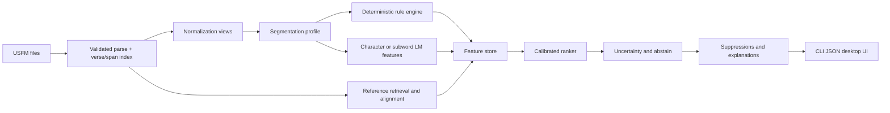
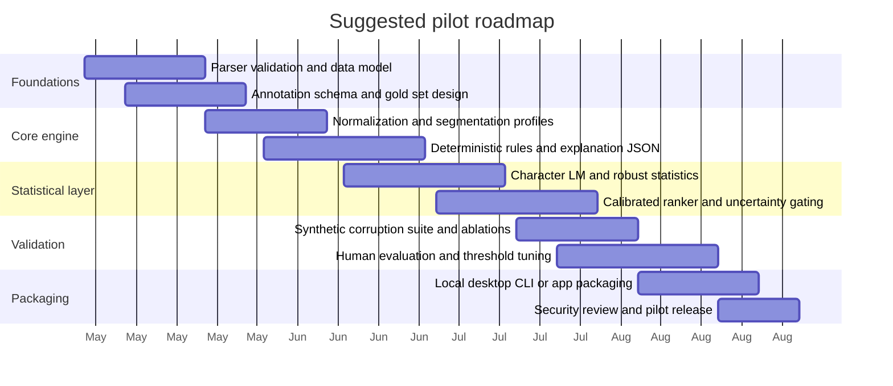

# Deep Research Assessment of Scripture Sous-Chef

## Executive Summary

The uploaded pitch describes *scripture-sous-chef* as a local-first, Rust-centered engine for heuristic and statistical QA over USFM scripture files, with a deliberately narrow MVP: detect suspicious surface patterns such as rare forms, duplicate phrases, punctuation irregularities, verse-length anomalies, and reference-relative oddities, while explicitly avoiding spell-checking, semantic judgment, and LLM-driven review. That scoping is disciplined and good. It keeps the product aligned with auditable signals and with the realities of low-resource translation workflows. fileciteturn0file0

My central recommendation is to **keep the scope, but upgrade the method**. The best architecture is **hybrid symbolic-statistical**: a deterministic Rust rule engine for candidate generation, followed by a **calibrated probabilistic ranker** built from character/subword language-model features, robust reference-relative statistics, and explicit uncertainty estimates. That design fits the literature unusually well: sparse-data language modeling still benefits from strong smoothing and hierarchical shrinkage; token-free or byte/character models are more robust to orthographic noise and tokenizer brittleness; and modern neural scores are not trustworthy operational probabilities unless they are calibrated. citeturn2search4turn25search2turn2search2turn1search6turn1search7turn3search0turn3search1turn12search0

For the target setting—majority-world and low-resource translation workflows like those historically associated with entity["organization","Wycliffe Associates","bible translation nonprofit"]—the main risk is not that the system will be too weak. The main risk is that it will be **confidently wrong for the wrong linguistic reasons**: default segmentation where tailored boundaries are needed, hapax alarms that punish rich morphology or dialect spelling, and single-reference comparisons that confuse legitimate translational divergence with genuine anomalies. Languages remain very unevenly represented in modern NLP, so the product should optimize for transparency, local overrideability, and community-specific calibration, not for maximal model size. fileciteturn0file0 citeturn18search0turn4search2turn4search3

The recommended architecture is summarized below. The choices reflect the pitch constraints, the USFM standard, Unicode segmentation requirements, and the strongest primary literature on low-resource multilingual modeling. fileciteturn0file0 citeturn27search2turn23view0turn2search4turn1search6turn1search7

| Layer                | Recommendation                                                                                      | Why this should be in v1                                                  |
| -------------------- | --------------------------------------------------------------------------------------------------- | ------------------------------------------------------------------------- |
| Ingest               | Validated USFM parser, typed spans, stable verse/span IDs                                           | Avoids fragile offset reconstruction and keeps markup-faithful processing |
| Text normalization   | Explicit Unicode normalization plus configurable segmentation profiles                              | Default Unicode rules are a baseline, not a universal proofreading policy |
| Candidate generation | Transparent deterministic rules                                                                     | Keeps false positives explainable and easy to suppress                    |
| Statistical scoring  | Character/subword LM features + robust verse/reference statistics + elastic-net or GBDT ranker      | Better ranking than thresholds alone, still interpretable                 |
| Calibration          | Temperature/isotonic/beta or Dirichlet calibration + abstain option                                 | Converts scores into usable review priorities                             |
| Reference handling   | Multi-reference aggregation when available; principled fallback to single reference or no reference | Reduces reference-specific bias                                           |
| UX and governance    | Explanations, suppressions, provenance, conservative defaults, no auto-correction                   | Maintains trust and reduces social harm                                   |

## Critique of the Current Pitch

The pitch gets several important things right. It treats the tool as a **review assistant**, not an autonomous editor; it prefers a **local/offline** architecture; it chooses a **format-native** input in USFM; and it scopes the MVP toward anomaly triage instead of spelling or semantic correction. Those are strong product instincts. USFM is indeed a plain-text markup standard used for scripture workflows and documented in materials associated with entity["organization","United Bible Societies","scripture standards consortium"], so making the ingest layer standard-aware is the correct foundation. fileciteturn0file0 citeturn27search2turn27search4

The first major weakness is **segmentation optimism**. The proposal assumes that word- and grapheme-like units can be extracted by default Unicode behavior and then treated as linguistically meaningful alert units. The entity["organization","Unicode Consortium","standards body"] explicitly presents UAX #29 as a **default** segmentation standard, notes that orthographic conventions vary across scripts and languages, and permits tailored profiles and programmatic overrides. That matters here. In Indic, Southeast Asian, mixed-script, or transliterated text, the “right” proofreading unit is often project-specific. Segmentation policy therefore needs to be first-class configuration, not an invisible library choice. citeturn23view0

The second weakness is **overreliance on raw heuristics under sparse, heterogeneous data**. “Hapax = suspicious,” “length ratio = suspicious,” and “z-score outlier = suspicious” are all useful intuitions, but none is stable enough to stand alone. Parallel Bible resources themselves note that verse alignments are imperfect and that one translation may split or merge verses relative to another. At the same time, classic language-modeling work shows that sparse counts are better handled by smoothing and hierarchical shrinkage than by raw-frequency thresholds. In practice, verse-length checks should use log ratios with robust normalization, and rare-word checks should back off to character/subword surprisal rather than treating all low counts as equally alarming. citeturn16search18turn2search4turn25search2

The third weakness is **linguistic confounding**. In low-resource languages, rare forms often reflect morphology, derivation, compounding, dialect spelling, inconsistent orthography, or locally accepted transliteration. They are not inherently “errors.” Work on linguistic diversity and participatory low-resource NLP repeatedly shows that high-resource assumptions transfer poorly, and that languages underserved by NLP are especially vulnerable to tools that encode a single prestige norm as if it were neutral. A production-quality version of this tool therefore needs community-reviewed annotation, data statements, and language-specific suppression or calibration policies from the beginning. citeturn18search0turn4search2turn3search3turn4search0

The fourth weakness is **engineering under-specification**. A strings-only core is a sensible systems choice, but internally the engine still needs stable verse IDs, grapheme and token spans, multiple normalized views of the same text, and a persistent explanation schema for rules and suppressions. Otherwise, downstream logic will become brittle. Likewise, a homegrown parser may be acceptable eventually, but only after it is checked against the official USFM reference and at least one independent grammar/validator implementation. The most expensive bugs in a tool like this will not come from statistics; they will come from silent parse or span errors. fileciteturn0file0 citeturn27search2turn27search0

The critique can be stated compactly:

| Pitch assumption                              | Why it is weak                                                             | Better replacement                                               |
| --------------------------------------------- | -------------------------------------------------------------------------- | ---------------------------------------------------------------- |
| Default Unicode segmentation is “good enough” | Defaults are explicitly tailorable and can diverge from proofreading units | Project-level segmentation profiles and script-aware tests       |
| Single reference is a stable norm             | Verses can split/merge and stylistic divergence is common                  | Multi-reference median aggregation and alignment-aware fallbacks |
| Hapax or rare form implies suspicion          | Confounds morphology, names, dialects, transliteration                     | Character/subword surprisal plus cluster-level evidence          |
| Mean/std z-scores are adequate                | Heavy tails and small sample sizes make them unstable                      | Log transforms, median/MAD, hierarchical shrinkage               |
| Heuristic scores alone are enough             | Uncalibrated alerts produce reviewer fatigue                               | Calibrated ranking, confidence intervals, abstention             |
| Strings-only API is sufficient end-to-end     | Hidden offset reconstruction becomes fragile                               | Typed spans internally, strings-only externally                  |

## Research Foundations

The relevant literature is not one single field. It is the intersection of classical probabilistic language modeling, multilingual transformers, tokenization-free modeling, evaluation science, interpretability, calibration, and fairness in low-resource NLP. Much of the most relevant work appears through venues of entity["organization","Association for Computational Linguistics","publishing society"], PMLR, NeurIPS, and official project documentation. citeturn2search4turn1search1turn3search0turn13search0

| Theme                                            | Representative primary sources                                                                                                                                                                                                                                                        | Why they matter here                                                                                                                   |
| ------------------------------------------------ | ------------------------------------------------------------------------------------------------------------------------------------------------------------------------------------------------------------------------------------------------------------------------------------- | -------------------------------------------------------------------------------------------------------------------------------------- |
| Transformer foundations                          | *Attention Is All You Need* citeturn1search0; *BERT* and multilingual transfer via mBERT/XLM-R citeturn18search2turn1search1                                                                                                                                                   | Establish the modern multilingual encoder family and its cross-lingual strengths/limitations                                           |
| Probabilistic language models                    | Chen & Goodman on smoothing citeturn2search4; Teh on hierarchical Pitman–Yor LM citeturn25search2; KenLM for efficient estimation/querying citeturn2search2turn2search9                                                                                                     | Still the best transparent baselines for sparse, noisy, low-resource text scoring                                                      |
| Tokenization-free and noise-robust modeling      | CANINE citeturn1search7; ByT5 citeturn1search6; SentencePiece for raw-text subwording citeturn2search3                                                                                                                                                                       | Highly relevant because orthographic variation is part of the signal, not just preprocessing noise                                     |
| Massively multilingual seq2seq                   | mT5 citeturn28search2; M2M-100 citeturn28search1; NLLB/NLLB-200 citeturn8search4turn8search8                                                                                                                                                                                | Useful for optional late-stage review, synthetic data, or cross-reference retrieval, but not ideal as the first scoring layer          |
| Retrieval and hybrid systems                     | RAG citeturn24search0; OpenFst and Pynini for symbolic transduction citeturn26search1turn26search0                                                                                                                                                                             | Supports a design in which explicit memory and symbolic rules complement statistical scoring                                           |
| Evaluation metrics                               | BLEU citeturn5search0; sacreBLEU rationale citeturn5search1; chrF citeturn29search0; BERTScore citeturn5search2; COMET citeturn6search0                                                                                                                                | Important adjacent evaluation literature, though not the primary success criteria for this product                                     |
| Interpretability                                 | Integrated Gradients citeturn3search2; SHAP citeturn13search2; *Attention Is not Explanation* citeturn13search0                                                                                                                                                              | If the system uses neural rerankers, explanations must come from attribution methods or transparent features, not attention maps alone |
| Calibration and uncertainty                      | Temperature scaling citeturn3search0; beta calibration citeturn3search1; Dirichlet calibration citeturn12search0; conformal prediction tutorial citeturn11search0                                                                                                         | Essential if alert scores are used to prioritize human review                                                                          |
| Fairness, data governance, low-resource practice | Data Statements citeturn3search3; Blodgett et al. on language technology harms citeturn4search0; Bender et al. on large-model risks citeturn4search1; Nekoto et al. on participatory research citeturn4search2; Joshi et al. on linguistic inclusion citeturn18search0 | These are not “ethics add-ons”; they change how thresholds, annotations, and deployment should be designed                             |

Two conclusions from this literature are especially important. First, **tokenization-free or near-tokenization-free approaches are unusually well matched to this problem**. ByT5 and CANINE were motivated partly by the brittleness of fixed tokenization, and ByT5 reports stronger robustness on noise-sensitive tasks. For a proofreading assistant where spelling variants, punctuation, affixation, and segmentation differences can be diagnostic, that is a direct fit. citeturn1search6turn1search7turn2search3

Second, **large multilingual generative models should be treated as optional assistive modules, not default judges**. mT5, M2M-100, and NLLB are powerful and extremely useful, but the literature on low-resource inclusion and language-technology harms makes clear that model scale does not erase data imbalance or normative bias. If you eventually add a neural “reviewer,” it should sit behind provenance, uncertainty, and human override. citeturn28search2turn28search1turn8search4turn18search0turn4search1

## Methods, Data, and Evaluation

### Algorithms and Math-Level Design

I recommend a **three-stage scorer**: deterministic candidate generation, probabilistic ranking, and calibration/abstention. The rules should generate candidates conservatively; the scorer should then estimate which candidates are worth a human’s time. That separation is important because it lets you keep rules interpretable while still learning how much to trust them. citeturn2search4turn3search0turn11search0

For verse-length anomalies, replace raw ratio thresholds with a robust log-ratio model. For verse \(v\), target length \(L_v\), reference length \(R_v\), and smoothing constant \(\alpha > 0\),

\[
r_v = \log \frac{L_v + \alpha}{R_v + \alpha}.
\]

Then normalize within a comparison group \(g\) such as book, genre, or project profile using a robust z-score,

\[
z_v = \frac{r_v - \operatorname{median}(r_{g})}{1.4826 \cdot \operatorname{MAD}(r_{g}) + \varepsilon}.
\]

If multiple references are available, compute \(z_{v,r}\) against each reference \(r\) and aggregate with the median rather than the mean. This makes the system much less sensitive to a single stylistically odd or misaligned reference. That recommendation is partly inferential, but it is motivated by known verse-alignment irregularities in parallel Bible resources and by the need for robust treatment of sparse count data. citeturn16search18turn16search3turn2search4turn25search2

For rare-word and odd-form detection, use a **character or byte n-gram language model** with modified Kneser–Ney or hierarchical Pitman–Yor smoothing. At character level, with history \(h\), next symbol \(c_t\), discount \(D\), and backed-off history \(h'\),

\[
P(c_t \mid h)
=
\frac{\max(C(hc_t)-D,0)}{C(h)}
+
\lambda(h) P(c_t \mid h'),
\]

where \(\lambda(h)\) redistributes discounted mass to lower-order contexts. Score a token or verse by average negative log probability or normalized surprisal. This is far better than a bare hapax flag because a form can be globally rare yet locally unsurprising under a character model. In low-resource settings, this often gives more stable signal than wordpiece-only models. citeturn2search4turn25search2turn2search2

For the learned ranker, combine transparent features into a regularized generalized linear model or gradient-boosted tree model. A strong first version is an **elastic-net logistic ranker**:

\[
\Pr(y_i = 1 \mid x_i)
=
\sigma(\beta_0 + x_i^\top \beta),
\]

with penalty

\[
\lambda
\left(
\alpha \|\beta\|_1 + \frac{1-\alpha}{2}\|\beta\|_2^2
\right).
\]

Feature groups should include intrinsic statistics, reference-relative features, parser/markup anomalies, duplication/edit-distance features, and metadata features such as project maturity or book. Elastic net keeps explanations sparse and reasonably stable. Gradient boosting is also viable, but it is harder to explain and calibrate cleanly. citeturn3search0turn3search1turn13search2

For lexical variant clustering, use weighted Damerau–Levenshtein distance over **normalized grapheme sequences**, optionally backed by a BK-tree or nearest-neighbor index. But do not equate surface similarity with error. Treat it as evidence that multiple spellings are circulating, then let the ranker decide whether a given spelling is truly suspicious given context, corpus frequency, and reference behavior. This is an engineering recommendation rather than a claim drawn from a single source, but it is strongly aligned with the tokenization-noise literature and with the pitch’s own concern about duplicate or near-duplicate forms. fileciteturn0file0 citeturn1search6turn1search7

### Uncertainty, Calibration, and Bayesian vs Frequentist Choices

For online production scoring, use **frequentist models with post-hoc calibration**. For offline governance and threshold tuning, use **Bayesian partial pooling**. That hybrid choice gives good runtime properties without giving up principled uncertainty estimation. citeturn3search0turn3search1turn12search0turn25search2

At the rule level, maintain posterior precision estimates with a Beta–Binomial model. If rule \(r\) has \(tp_r\) confirmed positives and \(fp_r\) false positives, then with prior \(\theta_r \sim \mathrm{Beta}(a,b)\),

\[
\theta_r \mid \text{data}
\sim
\mathrm{Beta}(a + tp_r,\; b + fp_r).
\]

This yields credible intervals for “how trustworthy is this rule” and shrinks unstable low-sample rules toward the global mean. For book- or language-specific thresholds, extend this to a hierarchical model so sparse languages borrow strength from the broader portfolio without being overwritten by it. The Pitman–Yor language-model literature is one useful precedent for this sort of hierarchical sharing in sparse language data. citeturn25search2turn25search5

For model-output calibration, start simple. If the ranker emits logits \(z\), temperature scaling uses

\[
\hat{p} = \mathrm{softmax}(z/T)
\]

with scalar \(T\) learned on a held-out calibration set. For binary outputs from non-neural models, beta calibration is often preferable to logistic calibration:

\[
\hat{p}
=
\sigma\!\left(a\log s - b\log(1-s) + c\right),
\]

where \(s\) is the raw score. For multiclass alert taxonomies, Dirichlet calibration is the natural extension:

\[
\hat{p}
=
\mathrm{softmax}(W \log p + b).
\]

In practice I would use temperature scaling for neural rerankers, beta calibration for binary triage models, and Dirichlet calibration if you move to multi-label or multi-class explanations. citeturn3search0turn3search1turn12search0

To reduce reviewer fatigue, add an **abstention layer** using conformal prediction or a simpler calibrated-uncertainty threshold. The operational rule should be “surface only alerts whose calibrated risk exceeds threshold and whose uncertainty is acceptably low.” This is one of the biggest gaps in the pitch: triage systems live or die by their ability to say “I’m not sure.” citeturn11search0turn11search5

### Datasets, Benchmarks, and Annotation Guidance

There is no single public benchmark that directly matches the target task: **verse- and token-level anomaly ranking for scripture translation QA**. That means you will need a bespoke gold corpus, even if you use public multilingual resources for pretraining, sanity checks, or stress tests. Modern multilingual benchmarks are still useful, but only as complements. On the benchmark side, the most influential recent multilingual resources come from entity["company","Meta","ai company"] and the community-run entity["organization","Open Language Data Initiative","open multilingual datasets"], and even these have required language-specific corrections after release. That is exactly why in-domain adjudication cannot be skipped. citeturn8search4turn20search0turn20search16

The public resources I would use are:

| Dataset or suite                | Coverage                                                                                 | Best use in this project                                                         | Main caveat                                                    |
| ------------------------------- | ---------------------------------------------------------------------------------------- | -------------------------------------------------------------------------------- | -------------------------------------------------------------- |
| OPUS / bible-uedin              | Bible-aligned corpus; OPUS lists bible-uedin at 88.3M aligned units citeturn16search0 | In-domain reference mining, language-model pretraining, phrase/verse retrieval   | License heterogeneity and noisy alignments                     |
| Massively Parallel Bible Corpus | Over 900 translations and 830+ language varieties citeturn16search3                   | Broad in-domain coverage and verse-level alignment experiments                   | Non-uniform quality and alignment quirks                       |
| JW300                           | 300+ languages, roughly 100k sentence pairs per pair on average citeturn7search1      | Low-resource transfer, multilingual lexical coverage                             | Religious domain differs from many Bible translation workflows |
| OLDI Seed                       | About 6,193 professionally translated seed sentences citeturn20search0turn20search6  | Small high-quality external reference set, calibration sanity checks             | Small; not scripture domain                                    |
| FLORES+ / FLORES-200            | 200+ languages, evaluation-focused citeturn20search0turn20search5turn8search4       | Secondary evaluation for multilingual encoder/reranker behavior                  | Not designed for proofreading alerting                         |
| Universal Dependencies          | 200+ treebanks, 150+ languages citeturn7search3                                       | Sanity checks for tokenization, morphology-aware features, segmentation profiles | Annotation style is linguistic, not editorial                  |
| BELEBELE                        | 122 language variants citeturn9search8                                                | Optional evaluation of multilingual understanding for neural modules             | Reading comprehension is not your core task                    |
| XTREME                          | 40 languages, 9 tasks citeturn9search2                                                | Cross-lingual transfer stress tests for encoder choices                          | Broad benchmark, indirect fit                                  |
| BLiMP                           | 67 English minimal-pair datasets citeturn9search1                                     | Sanity-checking grammatical sensitivity of optional English-centric modules      | English only                                                   |
| AmericasNLP shared tasks        | Truly low-resource Indigenous languages and related tasks citeturn9search3            | Stress-testing ideas on languages more like the target setting                   | Still indirect to scripture QA                                 |

For the **gold dataset**, I would build a stratified corpus across at least 8–12 languages spanning multiple scripts and orthographic regimes: Latin, Cyrillic if relevant, one or more Indic scripts, at least one right-to-left script if that is in scope, and one language with active orthography variation. Sample across books, project maturity, and reference availability. Annotate at three levels: **token**, **verse**, and **document/systemic issue**. The label taxonomy should include at minimum: likely typo, suspicious proper noun, suspicious verse length, duplication/near-duplication, punctuation/markup anomaly, acceptable variation, and uncertain. Use double annotation plus adjudication, and record the rationale behind each decision as structured metadata. Data Statements and participatory low-resource practice strongly support this approach. citeturn3search3turn4search2turn18search0

I also recommend a **synthetic corruption suite**. Seed known errors such as doubled words, deleted tokens, swapped punctuation, malformed USFM markers, verse split/merge mismatches, inserted transliteration variants, and low-rate character noise. Synthetic noise is not a substitute for human labels, but it is very useful for measuring controlled recall and for regression testing during development. Work on synthetic noise robustness in NLP supports exactly this use. citeturn19search10turn1search6

### Evaluation Plan

The evaluation target is **human review utility**, not abstract language-model quality. That means the key question is not “How good is the score?” but “Does the system help reviewers find real issues faster, with fewer distracting alerts?” Adjacent MT metrics like BLEU, chrF, BERTScore, and COMET are still useful for optional source-relative modules, but they should remain secondary. The main product metrics must be alert-centric and reviewer-centric. citeturn5search0turn5search1turn29search0turn5search2turn6search0

| Metric                                  | What it measures                                  | Why it matters                                     |
| --------------------------------------- | ------------------------------------------------- | -------------------------------------------------- |
| Precision@k                             | Fraction of true issues among top-k alerts        | Best proxy for reviewer time value                 |
| Recall on adjudicated issues            | Fraction of gold issues surfaced by the tool      | Prevents overly conservative tuning                |
| Recall on synthetic corruptions         | Ability to detect controlled, known anomalies     | Good regression metric during development          |
| Alert rate per 1k tokens or per chapter | Reviewer burden                                   | Prevents unusably noisy systems                    |
| PR-AUC                                  | Ranking quality under class imbalance             | Better than raw accuracy for sparse alerts         |
| Brier score / log loss                  | Probability quality                               | Helps compare calibrated models                    |
| ECE + reliability diagrams              | Calibration quality                               | Critical for thresholds and abstention             |
| Inter-annotator agreement               | Label reliability                                 | Guards against pseudo-gold data                    |
| p50/p95 latency and peak RSS            | Runtime quality                                   | Important for local and offline deployment         |
| Suppression half-life                   | How often users keep suppressions vs reverse them | A product-level proxy for false-positive annoyance |

Use the following baselines:

1. **Current pitch baseline**: deterministic rules and thresholds only.  
2. **Rules + robust stats**: same rules, but with log-transforms and median/MAD normalization.  
3. **Character LM only**: no hand-coded heuristics beyond parsing.  
4. **Rules + statistical ranker**: the recommended hybrid baseline.  
5. **Rules + neural reranker**: optional byte or token-free transformer layer.  
6. **Ablations**: remove references, remove normalization tailoring, remove calibration, remove uncertainty gating, and compare single-reference vs multi-reference settings.

For significance testing, use **paired methods** because the same verse or token instances are being scored by multiple systems. For binary decisions on the same items, McNemar-style paired testing is appropriate; for ranking and aggregate score comparisons, use paired bootstrap or randomization procedures. Dror et al. and Koehn remain the best compact references for significance testing practice in NLP evaluation. citeturn10search1turn10search0

For sample-size planning, a practical first-pass set of targets is:

- To estimate a rule precision around **70%** with a 95% margin of error of **±5 points**, you need about **323 adjudicated alerts** using the standard normal approximation. citeturn21calculator1  
- To estimate a false-positive rate around **10%** with a 95% margin of error of **±2 points**, you need about **865 adjudicated non-issues**. citeturn21calculator0  
- To conservatively detect an improvement from **70% to 77%** precision while treating systems as independent, you would need about **623 evaluated alerts per system**; a paired design will usually require fewer. citeturn21calculator2

Those are not final power analyses, but they are good planning anchors. In product terms, I would not trust any serious threshold decision until I had at least **300–500 adjudicated positives per major alert family** and enough negatives to estimate the operational false-positive burden with useful precision. citeturn10search1turn10search0turn21calculator0turn21calculator1

## Recommended Architecture and Engineering Trade-offs

The architecture should be **local-first, layered, and explanation-preserving**. The core engine stays in Rust. Research, annotation tooling, threshold search, and model calibration can live in Python. Optional neural modules should be exportable to ONNX or another portable inference format and treated as sidecars, not as hard dependencies of the core rules engine. That gives you a stable, inspectable system even when neural pieces are absent. fileciteturn0file0 citeturn33search1turn33search5

The model-family trade-offs are:

| Architecture option             | Strengths                                                                                            | Weaknesses                                                                                      | Best use                                |
| ------------------------------- | ---------------------------------------------------------------------------------------------------- | ----------------------------------------------------------------------------------------------- | --------------------------------------- |
| Rules only                      | Fast, transparent, cheap, easy to suppress                                                           | Brittle thresholds, many false positives, weak ranking                                          | Prototype and minimum viable baseline   |
| **Hybrid symbolic-statistical** | Best balance of trust, cost, and accuracy; can stay local/offline; explanations remain feature-based | More engineering work than rules only                                                           | **Recommended production architecture** |
| Neural-heavy reviewer           | Stronger contextual sensitivity; can suggest richer explanations                                     | Expensive, harder to calibrate, less equitable across low-resource languages, weaker provenance | Optional later-stage module only        |

That table is a synthesis of the pitch constraints and the literature on smoothing, token-free models, multilingual encoders, retrieval, calibration, and low-resource governance. fileciteturn0file0 citeturn2search4turn25search2turn1search6turn1search7turn28search2turn24search0turn3search0turn4search1turn18search0

A practical component stack would look like this:

| Library or project                  | Recommended role                                                            | Why it fits                                                                                                                    |
| ----------------------------------- | --------------------------------------------------------------------------- | ------------------------------------------------------------------------------------------------------------------------------ |
| KenLM                               | Fast n-gram estimation and query engine                                     | Strong transparent baseline for sparse language modeling citeturn2search2turn2search9                                      |
| SentencePiece                       | Raw-text subword or unigram segmentation                                    | Useful when whitespace tokenization is unreliable citeturn2search3                                                          |
| OpenFst + Pynini                    | Rewrite rules, transliteration, controlled symbolic normalization           | Excellent for explainable symbolic components citeturn26search1turn26search0                                               |
| External USFM grammar/validator     | Parser conformance testing and research harness                             | Reduces parser-risk early citeturn27search0turn27search2                                                                   |
| Hugging Face Transformers ecosystem | Access to optional mT5/ByT5/CANINE checkpoints and research experimentation | Convenient way to test optional multilingual or byte-level models citeturn33search0turn1search6turn1search7turn28search2 |
| ONNX Runtime                        | Portable inference for optional neural rerankers                            | Good fit for CPU/GPU deployment without framework lock-in citeturn33search1turn33search3                                   |

On the Rust side, I would keep the production hot path narrow and dependency-light: normalization, segmentation, compact indexes, batch scoring, parallel iteration, serialization, and explanation emission. Use Python only for experimentation, annotation tooling, and offline calibration. That matches the user’s implementation preferences and the product’s reliability requirements. fileciteturn0file0

Because the pitch estimates a whole-Bible plain-text payload on the order of only a few megabytes and roughly hundreds of thousands of words, a rules-plus-character-model system should fit comfortably on commodity CPU hardware. A GPU is only needed if you add a byte-level or transformer reranker. The public list-price examples below use commodity configurations from entity["company","Amazon Web Services","cloud provider"] and entity["company","Google Cloud","cloud provider"]; exact totals vary by region, discount plan, storage, and network usage. The latency ranges are engineering estimates informed by the pitch’s data scale and the cited instance specs, not benchmarked measurements. fileciteturn0file0 citeturn15view0turn15view2turn15view3turn15view4turn15view5turn14search11turn14search16turn14search6

| Deployment profile            | Example configuration                                                 |               Public hourly price |          Approx. monthly list price | Practical use                               |
| ----------------------------- | --------------------------------------------------------------------- | --------------------------------: | ----------------------------------: | ------------------------------------------- |
| Local/offline desktop         | Developer or reviewer laptop CPU                                      |                               N/A |                                 N/A | Preferred default for privacy and field use |
| Small centralized CPU service | AWS c7i.xlarge, 4 vCPU, 8 GiB citeturn15view3turn14search11       | ~$0.1785/hr citeturn14search11 | ~$128.5/mo citeturn22calculator0 | Rules + robust stats + char LM              |
| Small centralized GPU service | GCP g2-standard-4, 1×L4, 4 vCPU, 16 GiB citeturn14search6          |  ~$0.7068/hr citeturn14search6 | ~$508.9/mo citeturn22calculator2 | Optional byte/transformer reranking         |
| Small centralized GPU service | AWS g6.xlarge, 1×L4, 4 vCPU, 16 GiB citeturn15view2turn14search16 | ~$0.8048/hr citeturn14search16 | ~$579.5/mo citeturn22calculator1 | Same as above if already on AWS             |

These prices imply that **light experimentation is cheap**. Ten GPU-hours on an L4-class instance cost only about **$7–$8** at list price, so the real budget driver is not experimentation cost; it is the human labor for annotation, calibration, and field validation. citeturn32calculator0turn32calculator1

The deployment patterns I would support are:

- **Local desktop/CLI first** for privacy, intermittently connected field environments, and low operational burden.  
- **Batch job mode** for project-wide QA runs before review cycles.  
- **Optional GPU sidecar** only for post-ranking or explanation enrichment.  
- **No cloud dependency for the core path**. If the network disappears, the product should still work.

## Roadmap, Governance, and Risk Controls

Assuming language, cloud provider, editor integration, and scale are genuinely open-ended, the fastest credible path is a **four- to six-month pilot** by a small cross-functional team: one systems engineer, one computational linguist or annotation lead, one applied ML/statistics contributor part-time, and QA/product support. The goal of the pilot is not “full intelligence.” The goal is a **trusted, low-noise, well-calibrated alert pipeline**. That is the right target for the product category described in the pitch. fileciteturn0file0

A practical milestone plan is:

| Milestone             | Deliverables                                                                       | Required expertise                                | Effort estimate |
| --------------------- | ---------------------------------------------------------------------------------- | ------------------------------------------------- | --------------- |
| Foundation            | Validated parse tree, stable span model, corpus manifests, annotation guidelines   | Rust, USFM familiarity, computational linguistics | 3–4 weeks       |
| Baseline engine       | Deterministic rules, normalization profiles, JSON explanations, suppression system | Rust, Unicode/text-processing                     | 4–5 weeks       |
| Statistical layer     | Character LM features, robust verse/reference scoring, calibrated ranker           | Applied ML, statistics, NLP                       | 4–6 weeks       |
| Evaluation and tuning | Gold labels, corruption suite, ablations, significance testing, threshold search   | Annotation lead, statistician, QA                 | 4–5 weeks       |
| Packaging and pilot   | Local-first packaging, logging, security hardening, docs, pilot metrics            | Systems, QA, product                              | 3–4 weeks       |

Security and privacy should be handled as if the tool will eventually encounter sensitive or licensing-restricted texts. The safest default is **local processing with no third-party model API calls**. If remote execution is later added, require encryption in transit and at rest, project-scoped access control, auditable logs, and explicit policies for data retention, suppression files, and exported reports. The pitch’s local-first bias is a major advantage here and should be preserved. fileciteturn0file0 citeturn4search1turn3search3

The ethical risk is not abstract “AI bias.” It is much more specific: the tool could implicitly enforce a prestige orthography, suppress valid dialect forms, or pressure reviewers to “normalize” language in ways the local community rejects. The literature on language technology harms, linguistic underrepresentation, and participatory low-resource practice makes this risk explicit. The mitigation is equally concrete: conservative defaults, visible explanations, abstention, per-language calibration, community-reviewed gold data, and structured data statements for every language/project you support. citeturn4search0turn3search3turn4search2turn18search0

There is also a benchmark-quality risk. Even high-profile multilingual resources such as FLORES and OLDI extensions have needed language-specific corrections after release. That is an important lesson for this product: benchmarks are useful, but they are not ground truth for orthographic acceptability or community norms. Always privilege in-domain adjudication over benchmark prestige. citeturn20search16turn20search21turn20search0

The bottom line is straightforward. This tool is a **good product idea** and a **bad pure-heuristics idea**. It should be built as a **local-first, format-aware, hybrid symbolic-statistical review assistant** with robust segmentation, calibrated scoring, abstention, and community-specific evaluation. If you build it that way, it can be genuinely useful in low-resource translation QA. If you build it as a pile of uncross-checked thresholds over default tokenization and single-reference comparisons, it will likely become another noisy checker that reviewers learn to ignore. fileciteturn0file0 citeturn23view0turn2search4turn1search6turn3search0turn4search2turn18search0